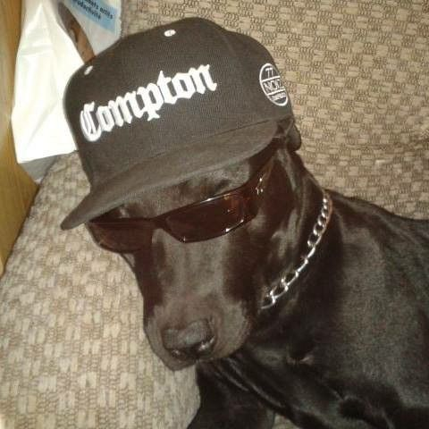

  

<h1 align="center">Pedro Amaral Chapelin</h1>

  Full-stack dev who does a little bit of everything. 
  React on the front, Java on the back. 
  Also mess around with computer vision, just because I think it's cool.

<h3 align="center">Hit me up if you want to level up your business</h3>

  🇧🇷 +55 (41) 98720-3883 
  📧 <a href="mailto:chapelinpedro@gmail.com">chapelinpedro@gmail.com</a> 
  🌐 <a href="https://chapelin.com.br">chapelin.com.br</a>

  <picture>
    <source media="(prefers-color-scheme: dark)" srcset="https://raw.githubusercontent.com/amalra1/amalra1/output/github-snake-dark.svg" />
    <source media="(prefers-color-scheme: light)" srcset="https://raw.githubusercontent.com/amalra1/amalra1/output/github-snake.svg" />
    
  </picture>

